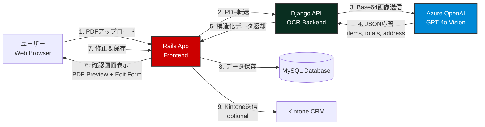
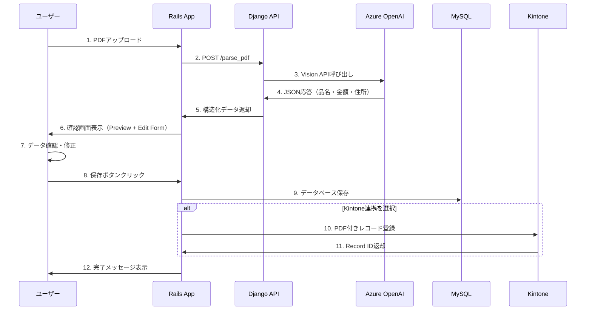

# 🚀 AI Vision見積書OCRシステム


## 📋 プロジェクト概要

従来のOCRの限界を突破した、**GPT-4o Vision APIベースの次世代見積書データ化システム**です。

### なぜVision APIを選択したのか？

従来のOCR（Optical Character Recognition）は、単純な文字認識には優れていますが、複雑なレイアウトや文字化け、微妙な汚れがあると精度が急落します。特に自動車整備業界の見積書は、業者ごとにフォーマットがバラバラで、手書き修正や印刷品質の劣化が頻発するため、**従来のOCRでは実用に耐えませんでした**。

本システムは、**Azure OpenAI GPT-4o Vision API**を採用することで、以下の革新的な優位性を実現しています：

| 項目 | 従来のOCR | Vision API（本システム） |
|------|-----------|-------------------------|
| **文字化け耐性** | ❌ 低い（汚れや歪みに弱い） | ✅ 高い（文脈から推論） |
| **レイアウト理解** | ❌ 表構造の認識が困難 | ✅ 視覚的に表全体を認識 |
| **Grand Total抽出** | ❌ 「小計」と「総合計」を混同 | ✅ 文脈から正確に分類 |
| **住所フィルタリング** | ❌ 自社住所と業者住所を区別不可 | ✅ ルールベースで除外可能 |
| **品名の正規化** | ❌ 記号・部品番号の除去が困難 | ✅ プロンプトで柔軟に指示可能 |

**結論**: Vision APIは単なるOCRではなく、「画像を理解するAI」です。これにより、**人間のように見積書を"読む"** ことが可能になりました。

---

## 🏗️ アーキテクチャ



### コンポーネント構成

- **Rails App (Frontend)**: ユーザーインターフェース、PDF preview、Human-in-the-Loop編集機能
- **Django API (Backend)**: Vision API統合、画像前処理、JSON変換
- **Azure OpenAI**: GPT-4o Vision APIによる画像解析エンジン
- **MySQL Database**: 見積データの永続化ストレージ
- **Kintone Integration**: オプションの外部CRM連携

---

## ✨ 主要機能

### 1. 🔍 AI Vision解析エンジン

**django_ocr/utils/azure_openai_client.py**

従来のOCRを超えた、GPT-4o Visionベースの知的解析システム：

- **文字化け・汚れへの耐性**: 文脈推論により、部分的に不鮮明な文字でも正確に認識
- **Grand Total vs Subtotalの厳格な分類**:
  - 見積書の最下部にある「総合計（税込）」を `total_amount_incl_tax`（最終支払金額）として抽出
  - 中間集計の「小計（税抜）」を `total_amount_excl_tax`（消費税前金額）として分類
  - 「消費税」という行の前後関係から自動判定
- **住所の自動フィルタリング**:
  - 見積書に含まれる「自社住所」（例: 東京都渋谷区神南1-19-4）を除外
  - 業者（工場・修理店）の住所のみを `vendor_address` として抽出
- **品名の正規化**:
  - 記号や部品番号を除去（例: `#バッテリー` → `バッテリー`）
  - 純粋な日本語品名のみを抽出

**システムプロンプトの設計哲学**:
```python
# 視覚的な表構造の認識 → 品名・数量・金額の列を識別
# Grand Total（お客様が実際に支払う最終金額）の厳格な定義
# 業者住所のルールベース抽出（自社住所を除外）
```

### 2. 🎨 Human-in-the-Loop UI

**rails_app/app/views/estimates/review.html.erb**

AIの解析結果を**人間が必ず確認・修正**してから保存する安全設計：

- **2カラムレイアウト**:
  - 左: 元のPDF/画像プレビュー（iframeによるインライン表示）
  - 右: AI抽出データの編集フォーム
- **並列比較による品質保証**:
  - ユーザーは元データを見ながらAI抽出値を検証可能
  - 業者名、住所、見積日、明細項目、合計金額をすべて確認可能
- **視覚的なフィードバック**:
  - 黄色の警告バー: 「AI解析結果（下書き）- 必ず確認してください」
  - TailwindCSSによる洗練されたUI/UX

**PDFプレビュー実装**:
```ruby
# app/controllers/estimates_controller.rb
def preview_file
  send_file temp_pdf_path,
            type: 'application/pdf',
            disposition: 'inline'  # ブラウザ内表示
end
```

### 3. ⚡ リアクティブUX

**JavaScript自動計算ロジック**

Excel風のリアルタイム再計算により、ストレスフリーな編集体験を実現：

- **モーダル（確認ダイアログ）の完全撤廃**:
  - 従来: 数量変更 → 「再計算しますか？」 → OK → 更新（煩雑）
  - 改善後: 数量変更 → 即座に合計更新（Excel風）
- **即時フィードバック**:
  ```javascript
  // 明細の数量または金額が変更されたら即座に再計算
  itemsTable.addEventListener('input', (e) => {
    if (e.target.classList.contains('item-quantity') ||
        e.target.classList.contains('item-amount')) {
      recalculateTotals();  // モーダルなし、即実行
    }
  });
  ```
- **計算式**:
  - 各行小計 = `金額（税抜） × 数量`
  - 総合計（税抜） = `Σ(各行小計)`
  - 総合計（税込） = `Math.floor(総合計（税抜） × 1.1)`
- **ページロード時の自動同期**:
  - AI抽出値と明細行の合計が不一致の場合、自動的に再計算
  - 明細行を「マスターデータ」として扱い、合計フィールドは常に同期

### 4. 🔗 外部連携（Kintone Integration）

**rails_app/app/services/kintone_service.rb**

見積データを外部CRMシステム（Kintone）へワンクリック登録：

- **2つの保存オプション**:
  - 🟢 **保存のみ**: ローカルDBに保存（Kintoneには送信しない）
  - 🔵 **保存してKintoneに登録**: ローカル保存 + Kintone API連携
- **PDFファイルの自動添付**:
  - 元のPDFファイルをKintoneのレコードに添付
  - ユーザーは後からKintone上で元データを確認可能
- **エラーハンドリング**:
  - Kintone送信失敗時もローカルDBには保存済み（データロスト防止）
  - Flash messageで送信結果を明示的に通知

**実装ハイライト**:
```ruby
if save_action == 'kintone' && temp_pdf_path && File.exist?(temp_pdf_path)
  kintone_service = KintoneService.new
  kintone_result = kintone_service.push_estimate_with_file(@estimate, temp_pdf_path)

  if kintone_result[:success]
    flash[:success] = "見積を保存し、kintoneに送信しました (Record ID: #{kintone_result[:kintone_record_id]})"
  else
    flash[:warning] = "見積は保存されましたが、kintone送信に失敗しました"
  end
end
```

---

## 📦 必要要件

### システム要件
- **Docker**: 20.10以上
- **Docker Compose**: 2.0以上

### API資格情報
- **Azure OpenAI**:
  - API Key
  - Endpoint URL
  - Deployment Name (GPT-4o推奨)
- **Kintone** (オプション):
  - Subdomain
  - API Token
  - App ID

---

## 🚀 インストール＆セットアップ

### 1. リポジトリのクローン

```bash
git clone https://github.com/yourusername/document_ocr.git
cd document_ocr
```

### 2. 環境変数の設定

**Django側 (.env.django)**:
```bash
cp .env.example .env.django
```

以下を編集:
```env
# Azure OpenAI Configuration
AZURE_OPENAI_API_KEY=your_azure_openai_api_key_here
AZURE_OPENAI_ENDPOINT=https://your-resource.openai.azure.com/
AZURE_DEPLOYMENT_NAME=gpt-4o
AZURE_API_VERSION=2024-12-01-preview
```

**Rails側 (.env.rails)**:
```bash
cp .env.example .env.rails
```

以下を編集:
```env
# MySQL Database
DATABASE_HOST=mysql
DATABASE_USERNAME=root
DATABASE_PASSWORD=your_mysql_password
DATABASE_NAME=ocr_development

# Django OCR Service
DJANGO_OCR_URL=http://django:8000

# Kintone (Optional)
KINTONE_SUBDOMAIN=your-subdomain
KINTONE_API_TOKEN=your_kintone_api_token
KINTONE_APP_ID=123
```

### 3. Docker Composeでビルド＆起動

```bash
docker-compose up --build
```

初回起動時、以下のサービスが立ち上がります：
- **Rails**: http://localhost:3000
- **Django**: http://localhost:8000
- **MySQL**: localhost:3306

### 4. データベースの初期化

別のターミナルで実行:
```bash
# Railsコンテナ内でマイグレーション実行
docker-compose exec rails bin/rails db:create db:migrate
```

### 5. 動作確認

ブラウザで http://localhost:3000 にアクセス。見積書アップロード画面が表示されればOK。

---

## 💡 使い方

### 基本的なワークフロー



### 1. 見積書のアップロード

- トップページ (http://localhost:3000) にアクセス
- 「PDFファイルを選択」ボタンをクリック
- 見積書PDF/画像を選択
- 「アップロードして解析」ボタンをクリック

### 2. AI解析結果の確認・修正

自動的に確認画面へ遷移します：

- **左側**: 元のPDF/画像がプレビュー表示
- **右側**: AI抽出データの編集フォーム
  - 業者名
  - 業者住所（AI抽出値）
  - 見積日
  - 明細項目（品名、数量、金額、種別）
  - 合計金額（税抜・税込）

**リアルタイム計算**:
- 明細の数量・金額を変更すると、自動的に合計が再計算されます
- 確認ダイアログは表示されません（Excel風）

### 3. 保存

2つの選択肢があります：

- **🟢 保存のみ**: ローカルDBに保存（Kintone送信なし）
- **🔵 保存してKintoneに登録**: ローカルDB + Kintone連携

### 4. 保存後の確認

見積詳細ページへ自動遷移:
- 見積番号、業者情報、明細、合計金額を表示
- Kintone送信済みの場合、Record IDも表示
- AI価格分析結果（相場との比較）も表示（PriceAnalysisService）

---

## 📁 プロジェクト構成

```
document_ocr/
├── docker-compose.yml           # マルチコンテナ定義
├── .env.example                 # 環境変数テンプレート
│
├── django_ocr/                  # Django OCR Backend
│   ├── Dockerfile
│   ├── requirements.txt
│   ├── api/
│   │   └── views.py             # /parse_pdf エンドポイント
│   └── utils/
│       └── azure_openai_client.py  # Vision API統合
│
└── rails_app/                   # Rails Frontend
    ├── Dockerfile.mysql
    ├── Gemfile
    ├── app/
    │   ├── controllers/
    │   │   └── estimates_controller.rb  # PDF upload, preview, save
    │   ├── models/
    │   │   ├── estimate.rb
    │   │   └── estimate_item.rb
    │   ├── services/
    │   │   ├── django_pdf_parser.rb     # Django API client
    │   │   ├── kintone_service.rb       # Kintone integration
    │   │   └── price_analysis_service.rb
    │   └── views/
    │       └── estimates/
    │           ├── new.html.erb         # アップロード画面
    │           ├── review.html.erb      # 確認・修正画面
    │           └── show.html.erb        # 詳細表示
    └── db/
        └── migrate/
            └── 20260122003317_add_vendor_address_to_estimates.rb
```

---

## 🧪 テスト

### Django APIのヘルスチェック

```bash
curl http://localhost:8000/health
# Expected: {"status": "ok"}
```

### Rails APIのヘルスチェック

```bash
curl http://localhost:3000/health
# Expected: {"status": "ok"}
```

### Vision API統合テスト

```bash
# サンプルPDFで解析テスト
curl -X POST http://localhost:8000/parse_pdf \
  -F "file=@sample_estimate.pdf" \
  -F "vendor_name=テスト工場"
```

---

## 🛠️ トラブルシューティング

### Q1: Docker build時に `yaml.h not found` エラー

**原因**: libyaml-0-2がインストールされていない

**解決策**: `rails_app/Dockerfile.mysql` のbuild stageに以下を追加済み
```dockerfile
RUN apt-get install --no-install-recommends -y \
    libyaml-dev \
    libyaml-0-2
```

### Q2: CookieOverflow エラー

**原因**: セッションに大量データを保存している

**解決策**: 本システムではセッションに小さなメタデータのみ保存し、フォームパラメータでデータ伝送
```ruby
# session[:parsed_data] は使用しない
session[:temp_pdf_path] = temp_file.path  # 小さいパスのみ
```

### Q3: Kintone送信が失敗する

**確認項目**:
- `.env.rails` の `KINTONE_API_TOKEN` が正しいか
- `KINTONE_APP_ID` がアクセス可能か
- Kintoneのフィールドコードが一致しているか（`kintone_service.rb` 参照）

**ログ確認**:
```bash
docker-compose logs rails | grep Kintone
```

---

## 🌟 今後の拡張予定

- [ ] **マルチページPDF対応**: 複数ページの見積書を一括処理
- [ ] **手書き見積書対応**: Vision APIの文脈推論を活用した手書き文字認識
- [ ] **バッチ処理機能**: 複数PDFを一括アップロード→並列解析
- [ ] **AI価格異常検知**: 相場から大幅に乖離した金額を自動検出
- [ ] **カスタムプロンプト管理**: 業種別にVision APIプロンプトをカスタマイズ可能に

---

## 📄 ライセンス

MIT License

---

## 👤 作者

**Ryu Mahoshi**

このシステムは、従来のOCRの限界を超えるために、最先端のVision AI技術を活用した実験的プロジェクトです。
ポートフォリオとして、技術的な革新性と実用性の両立を目指して開発しました。

---

## 🙏 謝辞

- **Azure OpenAI**: GPT-4o Vision APIの強力な画像理解能力
- **Rails & Django**: 高速開発を可能にする両フレームワークのエコシステム
- **TailwindCSS**: 美しく保守性の高いUI構築
- **Kintone**: 柔軟なAPI連携による外部システム統合

---

**⭐ このプロジェクトが役に立ったら、ぜひスターをお願いします！**
