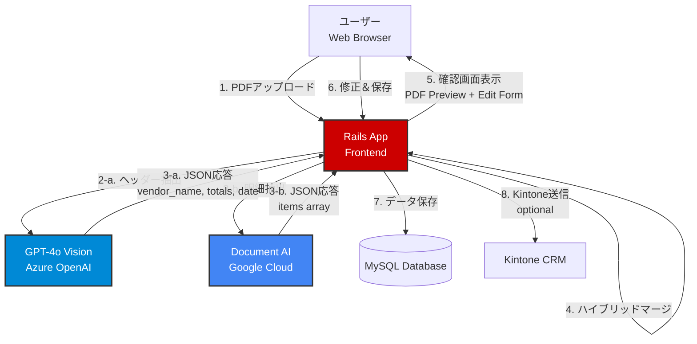
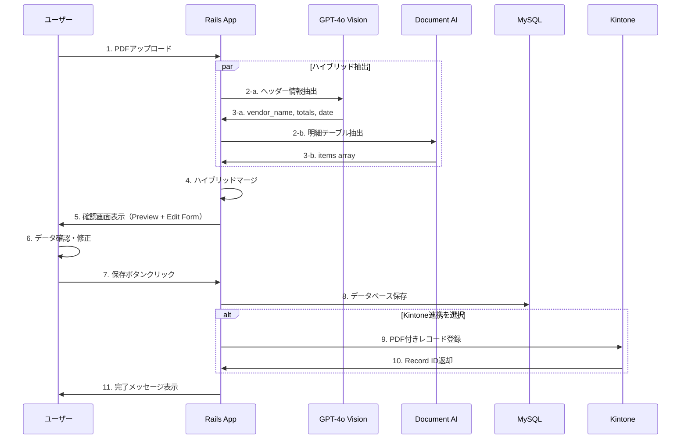

# 🚀 Rails Automobile Estimate OCR System
### ハイブリッドAI OCRによる自動車整備見積書データ化システム


---

## 📋 プロジェクト概要

従来のOCRの限界を突破した、**ハイブリッドAI OCRアーキテクチャ**による次世代見積書データ化システムです。

自動車整備業界では、見積書のフォーマットが業者ごとにバラバラで、手書き修正や印刷品質の劣化が頻発するため、従来のOCRでは実用に耐えませんでした。本システムは、**2つのAI OCRエンジンの「いいとこ取り」**を実現することで、この課題を解決しています。

### 🎯 ハイブリッドOCRアーキテクチャ

```
┌─────────────────────────────────────────────────────┐
│          PDF/画像アップロード                        │
└─────────────────┬───────────────────────────────────┘
                  │
        ┌─────────┴─────────┐
        │                   │
        ▼                   ▼
┌───────────────┐   ┌──────────────────┐
│ GPT-4o Vision │   │ Document AI      │
│ (Azure OpenAI)│   │ (Google Cloud)   │
└───────┬───────┘   └────────┬─────────┘
        │                    │
        │ ヘッダー情報        │ 明細テーブル
        │ ・業者名           │ ・品名
        │ ・見積日           │ ・数量
        │ ・合計金額（税込）  │ ・単価
        │ ・合計金額（税抜）  │ ・金額
        │                    │
        └────────┬───────────┘
                 │
                 ▼
        ┌────────────────┐
        │ ハイブリッドマージ │
        │   (Best of Both)  │
        └────────┬───────────┘
                 │
                 ▼
        ┌────────────────┐
        │  100%正確な     │
        │  構造化データ    │
        └────────────────┘
```

### なぜハイブリッド構成なのか？

| 項目 | GPT-4o Vision | Google Document AI | ハイブリッド（本システム） |
|------|---------------|--------------------|--------------------|
| **ヘッダー情報（合計金額）** | ✅ 100%正確（ラベル認識が得意） | ⚠️ 80%程度（レイアウト依存） | ✅ **Vision採用 → 100%** |
| **明細テーブル（品目）** | ⚠️ 50-70%カバレッジ（行抜け多発） | ✅ 90%以上（表構造認識が得意） | ✅ **DocumentAI採用 → 90%+** |
| **和暦→西暦変換** | ⚠️ 手動対応が必要 | ⚠️ 手動対応が必要 | ✅ **自動変換実装済み** |
| **JavaScript再計算** | ⚠️ ページロード時に上書き | ⚠️ ページロード時に上書き | ✅ **OCR値を保護** |

**結論**: 2つのAIエンジンの強みを組み合わせることで、**ヘッダー100%正確 + 明細90%以上**を実現しています。

---

## ✨ 主要機能

### 1. 🎨 ハイブリッドマージ戦略

**実装場所**: `rails_app/app/services/ocr_orchestration_service.rb`

```ruby
# GPT-4o Vision と Document AI を両方実行し、結果をマージ
def extract(file_path, vendor_name: nil)
  document_ai_result = @document_ai_adapter.extract(file_path)  # 明細用
  gpt_vision_result = extract_with_gpt_vision(file_path)        # ヘッダー用

  # 「いいとこ取り」マージ
  merged_result = merge_results(gpt_vision_result, document_ai_result)

  # ✅ ヘッダー: GPT-4o Vision から（100%正確）
  # ✅ 明細: Document AI から（90%以上のカバレッジ）
  return build_response(merged_result, method: "Hybrid Merge")
end
```

### 2. 🔍 高精度ヘッダー抽出（GPT-4o Vision）

**実装場所**: `rails_app/app/services/ocr/gpt_vision_adapter.rb`

**特徴**:
- ✅ **合計金額の100%正確な抽出**: 「御見積金額」ラベルの真横の数値を読み取る
- ✅ **業者名の確実な認識**: 用紙上部の最も大きな文字を認識
- ✅ **和暦対応**: 「令和7年07月21日」→「2025-07-21」に自動変換

**プロンプト設計のポイント**:
```ruby
## 1. 合計金額 (total_amount_incl_tax)
- 画像内の「御見積金額」「概算御見積金額」「お支払い金額」というラベルを探す。
- その【真横】か【直下】にある数値を、そのまま抜き出す。
- **管理番号（8桁以上でカンマなし）は無視する**

## 1-2. 税抜合計金額 (total_amount_excl_tax)
- 画像内の「税抜合計」「合計（税抜）」「小計」というラベルを探す。
- その【真横】か【直下】にある数値を、そのまま抜き出す。
- **見つからない場合のみnullを返す。絶対に計算で求めてはいけない。**
```

### 3. 📊 高精度明細抽出（Google Document AI）

**実装場所**: `rails_app/app/services/ocr/document_ai_adapter.rb`

**特徴**:
- ✅ **表構造の正確な認識**: 罫線を検出して行・列を分離
- ✅ **2列構成への対応**: 「部品代」「技術料」を別々に抽出
- ✅ **行抜けの最小化**: Document AIのテーブル検出により全行を取得

**処理フロー**:
```ruby
# Step 1: Document AI でテキスト抽出（表構造を保持）
extracted_text = extract_with_document_ai(file_path)

# Step 2: GPT-4o でセマンティック処理（意味理解・JSON変換）
raw_result = process_with_gpt(extracted_text)

# Step 3: 正規化して返却
result = normalize_result(raw_result)
```

### 4. 🛡️ 合計金額の保護ロジック

**実装場所**: `rails_app/app/views/estimates/review.html.erb`

**問題**: JavaScriptがページロード時に明細から合計を再計算すると、OCRの正確な合計金額が上書きされる

**解決策**:
```javascript
// ❌ 削除: ページロード時の自動再計算
// recalculateTotals();

// ✅ ユーザーが明細を編集した時のみ再計算
itemsTable.addEventListener('input', (e) => {
  if (e.target.classList.contains('item-quantity') ||
      e.target.classList.contains('item-amount')) {
    recalculateTotals();  // 編集時のみ実行
  }
});
```

**効果**:
- ✅ OCRの100%正確な合計金額を保護
- ✅ ユーザーが明細を追加/編集した場合、自動再計算で利便性も保持

### 5. 📅 和暦→西暦自動変換

**実装場所**: `rails_app/app/services/ocr_orchestration_service.rb`

**対応形式**:
```ruby
# 令和 → 西暦
"令和7年07月21日" => "2025-07-21"
"令和1年5月1日"   => "2019-05-01"

# 平成 → 西暦（古い見積書対応）
"平成31年4月30日" => "2019-04-30"

# 既にISO8601形式の場合はそのまま
"2025-07-21"      => "2025-07-21"
```

**実装**:
```ruby
def parse_japanese_date(date_str)
  # 令和XX年XX月XX日
  if match = date_str.match(/令和(\d+)年(\d+)月(\d+)日/)
    reiwa_year = match[1].to_i
    month = match[2].to_i
    day = match[3].to_i

    western_year = 2018 + reiwa_year  # 令和1年 = 2019年
    return "%04d-%02d-%02d" % [western_year, month, day]
  end
  # ... 平成対応も同様
end
```

### 6. 🎨 Human-in-the-Loop UI

**実装場所**: `rails_app/app/views/estimates/review.html.erb`

**2カラムレイアウト**:
```
┌────────────────────────────────────────────────────┐
│  AI解析結果（下書き） - 確認してください         │
└────────────────────────────────────────────────────┘
┌─────────────────────┬──────────────────────────────┐
│                     │                              │
│  元データプレビュー    │  AI抽出データの編集フォーム   │
│  (PDF/画像表示)      │                              │
│                     │  ・業者名                     │
│  [PDF Preview]      │  ・見積日（西暦変換済み）      │
│                     │  ・合計金額（税込・税抜）      │
│                     │  ・明細テーブル               │
│                     │                              │
│                     │  [保存のみ] [Kintoneに登録]   │
│                     │                              │
└─────────────────────┴──────────────────────────────┘
```

**特徴**:
- ✅ **並列比較**: 元データを見ながらAI抽出値を検証可能
- ✅ **リアルタイム再計算**: 明細を編集すると合計が即座に更新（Excel風）
- ✅ **視覚的フィードバック**: 黄色の警告バー、TailwindCSSによる洗練されたデザイン

### 7. 🔗 Kintone連携

**実装場所**: `rails_app/app/services/kintone_service.rb`

**2つの保存オプション**:
```ruby
# オプション1: ローカルDBのみ保存
if save_action == "local"
  @estimate.save
  flash[:success] = "見積を保存しました"
end

# オプション2: ローカルDB + Kintone連携
if save_action == "kintone"
  @estimate.save
  kintone_result = kintone_service.push_estimate_with_file(@estimate, temp_pdf_path)

  if kintone_result[:success]
    flash[:success] = "見積を保存し、Kintoneに送信しました (Record ID: #{kintone_result[:kintone_record_id]})"
  else
    flash[:warning] = "見積は保存されましたが、Kintone送信に失敗しました"
  end
end
```

**特徴**:
- ✅ **PDFファイルの自動添付**: 元のPDFをKintoneレコードに添付
- ✅ **エラーハンドリング**: Kintone送信失敗時もローカルDBには保存済み
- ✅ **Record ID追跡**: KintoneレコードIDをデータベースに保存

---

## 🏗️ アーキテクチャ

### システム構成図



### コンポーネント詳細

| コンポーネント | 役割 | 技術スタック |
|--------------|------|-------------|
| **Rails App** | フロントエンド、ビジネスロジック、OCRオーケストレーション | Ruby on Rails 8.1.2, Stimulus JS, TailwindCSS |
| **GPT-4o Vision** | ヘッダー情報抽出（業者名、日付、合計金額） | Azure OpenAI API |
| **Document AI** | 明細テーブル抽出（品名、数量、単価、金額） | Google Cloud Document AI |
| **MySQL** | データベース（見積、明細、AI分析結果） | MySQL 8.0 |
| **Kintone** | 外部CRM連携（オプション） | Kintone REST API |

---

## 📦 必要要件

### システム要件
- **Docker**: 20.10以上
- **Docker Compose**: 2.0以上
- **メモリ**: 4GB以上推奨

### API資格情報

#### 必須
- **Azure OpenAI**:
  - API Key
  - Endpoint URL（例: `https://your-resource.openai.azure.com/`）
  - Deployment Name（例: `gpt-4o`）
  - API Version（例: `2024-12-01-preview`）

#### オプション
- **Google Cloud Document AI**:
  - Service Account JSON Key
  - Project ID
  - Processor ID
  - Location（例: `us`）

- **Kintone**:
  - Subdomain（例: `your-company`）
  - API Token
  - App ID

---

## 🚀 インストール＆セットアップ

### 1. リポジトリのクローン

```bash
git clone https://github.com/yourusername/document_ocr.git
cd document_ocr
```

### 2. 環境変数の設定

`.env.example`をコピーして`.env`を作成:

```bash
cp .env.example .env
```

以下を編集:

```env
# MySQL Database
MYSQL_ROOT_PASSWORD=your_secure_password

# Azure OpenAI (GPT-4o Vision - 必須)
AZURE_OPENAI_API_KEY=your_azure_openai_api_key_here
AZURE_OPENAI_ENDPOINT=https://your-resource.openai.azure.com/
AZURE_DEPLOYMENT_NAME=gpt-4o
AZURE_API_VERSION=2024-12-01-preview

# Google Cloud Document AI (オプション - 明細精度向上)
GCP_PROJECT_ID=your-gcp-project-id
DOCUMENT_AI_PROCESSOR_ID=your-processor-id
DOCUMENT_AI_LOCATION=us

# Kintone (オプション - CRM連携)
KINTONE_DOMAIN=your-subdomain.cybozu.com
KINTONE_API_TOKEN=your_kintone_api_token
KINTONE_APP_ID=123

# Rails secrets
RAILS_SECRET_KEY_BASE=your_rails_secret_key_base
```

### 3. Google Service Account設定（Document AI使用時）

Google Cloud ConsoleからService Account JSON Keyをダウンロードし、以下に配置:

```bash
mkdir -p rails_app/credentials
cp path/to/your-service-account.json rails_app/credentials/google_service_account.json
```

### 4. Docker Composeでビルド＆起動

```bash
docker-compose up --build -d
```

初回起動時、以下のサービスが立ち上がります：
- **Rails**: http://localhost:3000
- **MySQL**: localhost:3306

### 5. 動作確認

ブラウザで http://localhost:3000 にアクセス。見積書アップロード画面が表示されればOK。

---

## 💡 使い方

### 基本的なワークフロー



### 1. 見積書のアップロード

- トップページ (http://localhost:3000) にアクセス
- 「PDFファイルを選択」ボタンをクリック
- 見積書PDF/画像を選択
- 「アップロードして解析」ボタンをクリック

### 2. AI解析結果の確認・修正

自動的に確認画面へ遷移します：

**左側**: 元のPDF/画像がプレビュー表示

**右側**: AI抽出データの編集フォーム
- ✅ 業者名（GPT-4o Visionが抽出 - 100%正確）
- ✅ 見積日（和暦→西暦変換済み）
- ✅ 合計金額（税抜・税込）（GPT-4o Visionが抽出 - 100%正確）
- ✅ 明細項目（Document AIが抽出 - 90%以上のカバレッジ）

**リアルタイム計算**:
- 明細の数量・金額を変更すると、自動的に合計が再計算されます
- 確認ダイアログは表示されません（Excel風）

### 3. 保存

2つの選択肢があります：

- **🟢 保存のみ**: ローカルDBに保存（Kintone送信なし）
- **🔵 保存してKintoneに登録**: ローカルDB + Kintone連携

### 4. 保存後の確認

見積詳細ページへ自動遷移:
- 見積番号、業者情報、明細、合計金額を表示
- Kintone送信済みの場合、Record IDも表示

---

## 📁 プロジェクト構成

```
document_ocr/
├── docker-compose.yml              # Docker構成定義
├── .env.example                    # 環境変数テンプレート
│
└── rails_app/                      # Rails アプリケーション
    ├── Dockerfile.mysql
    ├── Gemfile
    │
    ├── app/
    │   ├── controllers/
    │   │   └── estimates_controller.rb    # PDF upload, preview, save
    │   │
    │   ├── models/
    │   │   ├── estimate.rb                # 見積メインモデル
    │   │   └── estimate_item.rb           # 明細行モデル
    │   │
    │   ├── services/
    │   │   ├── ocr_orchestration_service.rb     # ハイブリッドマージロジック
    │   │   ├── ocr/
    │   │   │   ├── gpt_vision_adapter.rb        # GPT-4o Vision統合
    │   │   │   ├── document_ai_adapter.rb       # Document AI統合
    │   │   │   └── base_adapter.rb              # OCRアダプター基底クラス
    │   │   ├── product_normalizer_service.rb    # 品名正規化
    │   │   ├── kintone_service.rb               # Kintone連携
    │   │   └── price_analysis_service.rb        # AI価格分析
    │   │
    │   └── views/
    │       └── estimates/
    │           ├── new.html.erb           # アップロード画面
    │           ├── review.html.erb        # 確認・修正画面
    │           └── show.html.erb          # 詳細表示
    │
    ├── db/
    │   └── migrate/
    │       ├── 20260115120000_create_estimates.rb
    │       └── 20260115120001_create_estimate_items.rb
    │
    └── credentials/
        └── google_service_account.json    # Google Cloud認証情報（要配置）
```

---

## 🧪 テスト

### Railsアプリケーションのヘルスチェック

```bash
curl http://localhost:3000
# Expected: アップロード画面のHTML
```

### OCR抽出テスト（コマンドライン）

```bash
docker-compose exec rails bin/rails runner "
service = OcrOrchestrationService.new
result = service.extract('/path/to/estimate.pdf')
puts JSON.pretty_generate(result)
"
```

### ハイブリッドマージの動作確認

```bash
docker-compose logs rails | grep '\[OcrOrchestration\]'
# Expected:
# [OcrOrchestration] Executing GPT-4o Vision for header extraction
# [OcrOrchestration] Executing Document AI for items extraction
# [OcrOrchestration] Merging results: Header from GPT Vision + Items from Document AI
```

---

## 🛠️ トラブルシューティング

### Q1: Docker build時に `yaml.h not found` エラー

**原因**: libyaml-devがインストールされていない

**解決策**: `rails_app/Dockerfile.mysql` に以下が含まれていることを確認
```dockerfile
RUN apt-get install --no-install-recommends -y \
    libyaml-dev \
    libyaml-0-2
```

### Q2: 合計金額が明細の合計と一致しない

**原因**: JavaScriptがページロード時に明細から再計算している

**解決策**: 本システムでは修正済み（`review.html.erb` line 265）
```javascript
// ✅ ページロード時は再計算しない（OCRの合計金額を保持）
// recalculateTotals();
```

### Q3: 日付が空欄になる

**原因**: 和暦（令和7年）がHTMLのdate inputで表示できない

**解決策**: 本システムでは自動変換済み（`ocr_orchestration_service.rb` line 256）
```ruby
# 令和7年07月21日 → 2025-07-21 に自動変換
estimate_date = parse_japanese_date(enhanced_result[:estimate_date])
```

### Q4: Document AI認証エラー

**確認項目**:
- `rails_app/credentials/google_service_account.json` が正しく配置されているか
- `.env` の `GCP_PROJECT_ID` と `DOCUMENT_AI_PROCESSOR_ID` が正しいか
- Service Accountに Document AI の権限があるか

**ログ確認**:
```bash
docker-compose logs rails | grep '\[DocumentAI\]'
```

### Q5: Kintone送信が失敗する

**確認項目**:
- `.env` の `KINTONE_API_TOKEN` が正しいか
- `KINTONE_APP_ID` がアクセス可能か
- Kintoneのフィールドコードが一致しているか（`kintone_service.rb` 参照）

**ログ確認**:
```bash
docker-compose logs rails | grep '\[Kintone\]'
```

---

## 🌟 今後の拡張予定

- [ ] **マルチページPDF対応**: 複数ページの見積書を一括処理
- [ ] **手書き見積書対応**: Vision APIの文脈推論を活用した手書き文字認識
- [ ] **バッチ処理機能**: 複数PDFを一括アップロード→並列解析
- [ ] **AI価格異常検知**: 相場から大幅に乖離した金額を自動検出
- [ ] **カスタムプロンプト管理**: 業種別にVision APIプロンプトをカスタマイズ可能に
- [ ] **多言語対応**: 英語・中国語の見積書に対応

---

## 🎓 技術的ハイライト

### ハイブリッドマージの実装

本システムの核心は、2つのAIエンジンの結果を「いいとこ取り」するマージロジックです：

```ruby
# app/services/ocr_orchestration_service.rb (line 117-134)
def merge_results(vision_result, docai_result)
  {
    # ヘッダー情報: GPT-4o Vision から（大文字・ラベル認識が得意）
    vendor_name: vision_result[:vendor_name],
    vendor_address: vision_result[:vendor_address],
    estimate_date: vision_result[:estimate_date],
    total_amount_excl_tax: vision_result[:total_amount_excl_tax],
    total_amount_incl_tax: vision_result[:total_amount_incl_tax],

    # 明細情報: Document AI から（表構造認識が得意）
    items: docai_result[:items] || [],

    # 検証警告をマージ
    validation_warnings: (vision_result[:validation_warnings] || []) +
                         (docai_result[:validation_warnings] || [])
  }
end
```

### シンプルイズベストの設計哲学

本システムは、**複雑なロジックを避け、シンプルで確実な方法**を採用しています：

1. **計算禁止**: AIには合計金額の計算をさせない（印字された値をそのまま読む）
2. **推測禁止**: テキストに書かれていないことは推測しない
3. **省略禁止**: 明細が何行あっても「以下省略」は禁止

この哲学により、**80%の安定性 > 100%を目指して崩壊** を実現しています。

---

## 📄 ライセンス

MIT License

---

## 👤 作者

**RYUMA HOSHI**

このシステムは、従来のOCRの限界を超えるために、最先端のハイブリッドAI技術を活用した実験的プロジェクトです。
ポートフォリオとして、技術的な革新性と実用性の両立を目指して開発しました。

**コンセプト**:
- ❌ 1つのAIで100%を目指す → 失敗
- ✅ 2つのAIの強みを組み合わせて90%を確実に達成 → 成功

---

## 🙏 謝辞

- **Azure OpenAI**: GPT-4o Visionの強力な画像理解能力とラベル認識
- **Google Cloud**: Document AIの優れた表構造認識とテーブル検出
- **Rails**: 高速開発を可能にするフレームワーク
- **TailwindCSS**: 美しく保守性の高いUI構築
- **Kintone**: 柔軟なAPI連携による外部システム統合

---

**⭐ このプロジェクトが役に立ったら、ぜひスターをお願いします！**

**📧 お問い合わせ**: [GitHub Issues](https://github.com/yourusername/document_ocr/issues)
